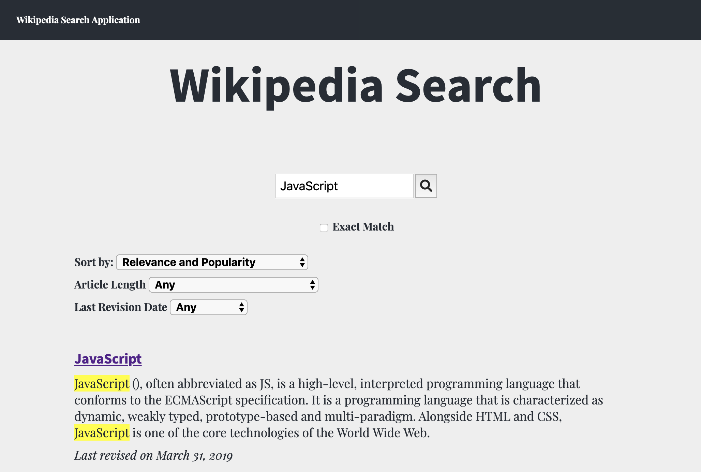

# Wikipedia Search

The Wikipedia Search engine is a website that allows users to search for Wikipedia articles on any topic. 

## Built With

* HTML
* CSS
* Vanilla JavaScript
* [Jasmine testing framework](https://jasmine.github.io/)
* [MediaWiki Action API](https://www.mediawiki.org/wiki/API:Main_page)

## Features

* Users can enter search text and find articles related to the search text
* Search results can be sorted by relevance, alphabetical order, reverse alphabetical order, most recently edited, or least recently edited
* Search results can be filtered by date modified (past week, past month, or past year) as well as by the word count of the article
* Users can use the MediaWiki nearmatch feature to search for only nearly exact matches
* The application scans for words matching any of the search terms in the extracts of search results and highlights the matching terms in yellow
* The application leverages multiple API endpoints in order to access title, wordcount and revision date data as well as an extract from each article and the url for each article
* CSS classnames utilize the BEM naming convention

## Tests

This project includes five tests written in Jasmine in the spec.js file.  To run the tests open the SpecRunner.html file.

## Credits
Application coded by Keith Murgic
Loading Icon downloaded from [Preloaders.net](https://icons8.com/preloaders/)